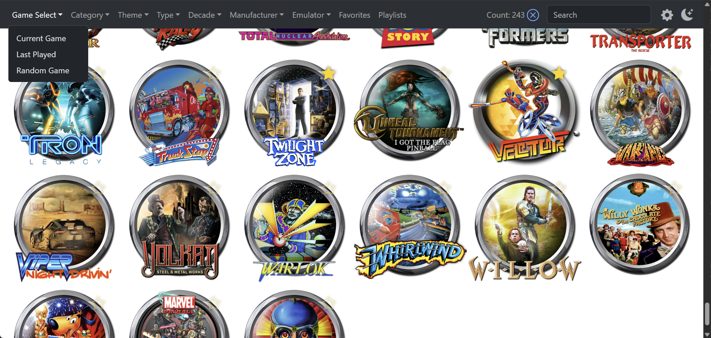
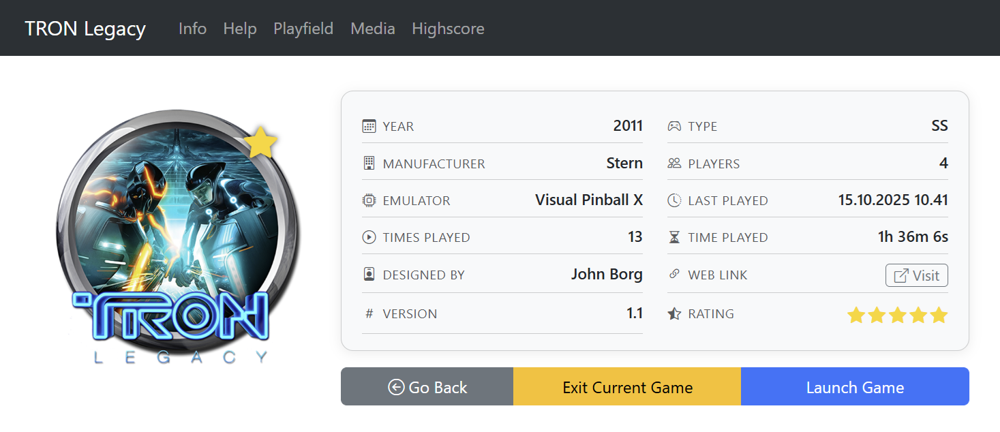
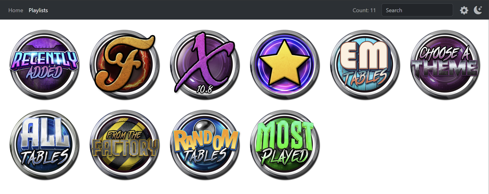

# Pinup Popper Browser

> A companion application to [Pinup Popper](http://www.nailbuster.com/wikipinup/) that allows you to browse the available games from another device.

This is an application powered by Node.js with Express to provide a view into your Pinup Popper system from any web browser on your internal network. It works by querying the PuP database to load the details of the games that have been configured, and presents them in a format that can be easily scrolled, filtered, or searched. The selected game can also be launched remotely from the app, which is enabled through the use of the [Web Remote Control for Pinup Popper](http://www.nailbuster.com/wikipinup/doku.php?id=web_remote_control).

## Fork Notes

This repository is a fork of the original `pinup-popper-browser` project with additional UI, playlist, media, and settings features.

Credit goes to the original creator, [doogie2301](https://github.com/doogie2301), for the original project and foundation this fork builds on:

- Original project: https://github.com/doogie2301/pinup-popper-browser

## Features

- **Main View** - Displays the Wheel images for all games in the Pinup Popper menu. Clicking on a wheel will go to the Game View for that game.

  

  - **Game Select** - Jumps to the Game View for a specific game
    - **Current Game** - The game currently in view in the Pinup Popper menu or the game currently being played.
    - **Last Played** - The game that was last played
    - **Random Game** - A randomly selected game
  - **Filters** - The game list can be filtered by one of the following fields: Category, Theme, Type, Decade, Emulator, Manufacturer, and Favorites.
  - **Search Box** - Filters the games by name containing the entered text
  - **Favorites** 🆕 - Favorite state is visible in the grid and can be toggled from the game view.
  - **Theme Toggle** 🆕 - Single-button light/dark mode toggle in the navbar.

- **Game View** - Displays the details for a single game

  

  - **Summary** - Disaplays the wheel image and basic information about the game
    - **Rating editor** 🆕 - Ratings can be changed directly in the game view.
    - **Favorite toggle** 🆕 - Favorite status can be changed directly in the game view.
    - **Web Link** 🆕 - Opens the configured game URL directly from the game view.
    - **Launch Game\*** - Launches the game in Pinup Popper
    - **Exit Current Game\*** - Exits the current game in Pinup Popper
  - **Info** - Displays any images starting with the game name from the GameInfo media folder
  - **Help** - Displays any images starting with the gaame name from the GameHelp media folder
  - **Playfield** - Displays an image or video with the game name from the Playfield media folder
  - **Highscore** 🆕 - Displays matching images from the configured highscore media folder.
  - **Media Overview** 🆕 - Shows Topper, BackGlass, Full DMD, DMD, Playfield, GameInfo, and GameHelp together in one view.

## Additional Features In This Fork

This fork expands the original project with a more modern UI, playlist browsing, a built-in settings experience, and additional media options.

### UI Refresh

The interface has been upgraded to Bootstrap 5 and Bootstrap Icons, and now includes light and dark themes with a single-button theme toggle in the navbar.

### Playlists

A dedicated Playlists view has been added with nested playlists, locked playlists, and a visual `Go Back` tile for easier navigation.

### Game View Improvements

The game view adds direct favorites and rating updates, a direct Web Link action, Highscore tab support, and a Media Overview tab for Topper, BackGlass, Full DMD, DMD, Playfield, GameInfo, and GameHelp.

### Settings And Configuration

This fork adds a built-in Settings page for managing the default view, visible game fields, game field ordering, media folder mappings, and other runtime options without manually editing `config.yml`.

### Mobile Improvements

The layout has been improved for mobile devices, including navigation, game actions, settings previews, and responsive media layouts.

## Setup

### Prerequisites

Features with an asterisk above require the following steps:

- [Enable Web Remote Control for Pinup Popper](http://www.nailbuster.com/wikipinup/doku.php?id=web_remote_control)
- Add the following line of code inside the GameLaunch(pMsg) method inside the PuPMenuScript.pup file (needed for the Current Game feature to work after game is launched):

       if (useWEB && WEBStatus) { PuPWebServer.MenuUpdate(pMsg); }

  Example:

  

### Installation

#### Using Node

Requires Node.js 18 or newer.

If you already have Node installed, you can download the source code and run the following commands:

    npm install
    node .

The advantage to this approach is that you have the ability to customize the code.

#### Running without Node

The application is also packaged as a standalone executable. This option does not require Node.js to be installed. Simply download and extract the contents of the latest PinUpBrowser.zip file from [the Releases tab](https://github.com/d3troy/pinup-popper-browser/releases), and run the PinUpBrowser.exe executable.

### Configuration

The config.yml file contains settings that can be modified to support your setup and adjust preferences. Changes will take effect after the application is restarted.

* **pupServer.url**
  
  Specify the URL for the PuPServer.

* **pupServer.db.path**
  
  Specify the full path to the Pinup database.

* **pupServer.db.filter**

  An optional condition used in the WHERE clause to filter the initial load of games.

* **httpServer.port**

  Specify the port number for this web host.

* **httpServer.logFormat**

  Format for debug logging (see https://github.com/expressjs/morgan#predefined-formats)

* **httpServer.logLevel**

  Set to 'error' to only log failed requests, or 'info' to log all requests.

* **options.kioskMode**

  Hides settings access from the main UI.

* **options.defaultView**

  Sets the default landing page for `/` to `home` or `playlists`.

* **options.filters**

  The filter menu options can be enabled/disabled individually.

  - `options.filters.category`
  - `options.filters.theme`
  - `options.filters.type`
  - `options.filters.decade`
  - `options.filters.emulator`
  - `options.filters.manufacturer`
  - `options.filters.favorites`

* **options.game**

  The Info, Help, Playfield, and Highscore menu options can be enabled/disabled individually.

  - `options.game.info`
  - `options.game.help`
  - `options.game.playfield`
  - `options.game.highscore`

* **options.game.media**

  Enable or disable slots in the Media Overview tab.

  - `options.game.media.topper`
  - `options.game.media.backglass`
  - `options.game.media.fulldmd`
  - `options.game.media.dmd`
  - `options.game.media.playfield`
  - `options.game.media.help`
  - `options.game.media.info`

* **options.dateFormat**

  Controls how dates are displayed in the game view and settings preview.

* **options.gameFields**

  Controls which metadata fields are shown in the game summary and in what order.

  Available fields:

  - `year`
  - `type`
  - `manufacturer`
  - `numPlayers`
  - `emulator`
  - `category`
  - `theme`
  - `rating`
  - `lastPlayed`
  - `numPlays`
  - `timePlayed`
  - `designedBy`
  - `webLinkUrl`
  - `gameVersion`
  - `gameDescription`
  - `romName`
  - `tableType`

* **media.useThumbs**

  Indicates whether to use the thumbnail images created by Pinup Popper for display. Turning this off will load the full sized Wheel media, which may slow the load time and browser responsiveness, but will not require the games to have been viewed in the Pinup Popper menu first.

* **media.cacheInMinutes**

  The number of minutes the browser should cache the media files.

* **media.playfieldRotation**

  Indicates whether Playfield media is rotated or not.

* **media.folders**

  Folder mapping for media lookup. This fork supports configuring `topper`, `backglass`, `fulldmd`, `dmd`, `playfield`, `help`, `info`, and `highscore`.

  - `media.folders.topper`
  - `media.folders.backglass`
  - `media.folders.fulldmd`
  - `media.folders.dmd`
  - `media.folders.playfield`
  - `media.folders.help`
  - `media.folders.info`
  - `media.folders.highscore`

### Settings UI

Most of the options above can also be managed directly from the built-in `/settings` page.

## Support

Bugs reports and enhancement requests can be submitted by [creating an  issue](https://github.com/d3troy/pinup-popper-browser/issues?q=is%3Aopen+is%3Aissue).

## Sponsoring

This project is a contribution to the virtual pinball community, and is completely free to use. If you would like to support this fork, you can use the button below. 

Please also consider sponsoring doogie for the original project this fork is based on.

## License

This project is licensed under the terms of the GPL-3.0 license.
